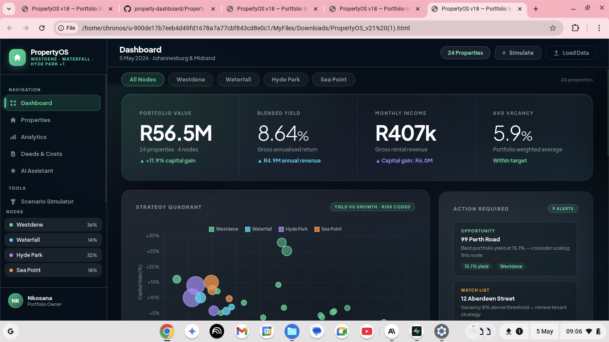
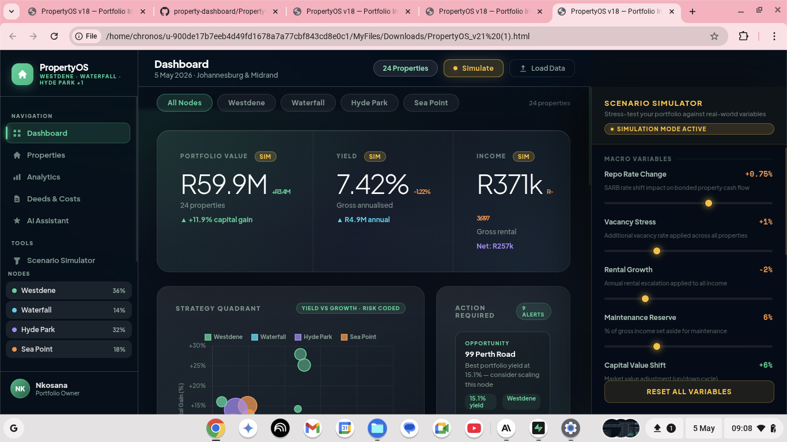
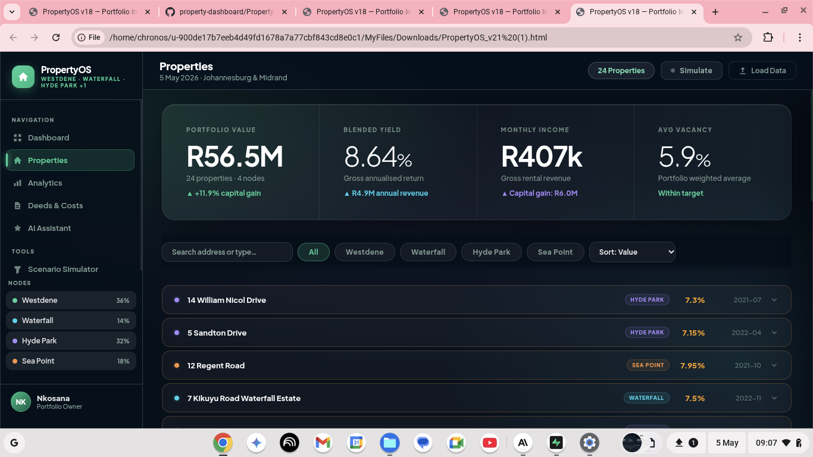
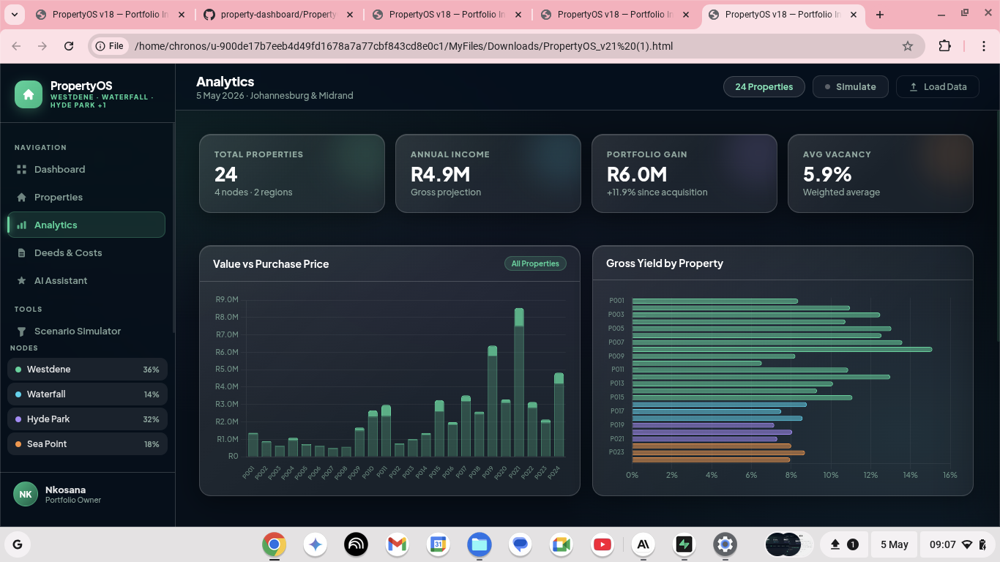
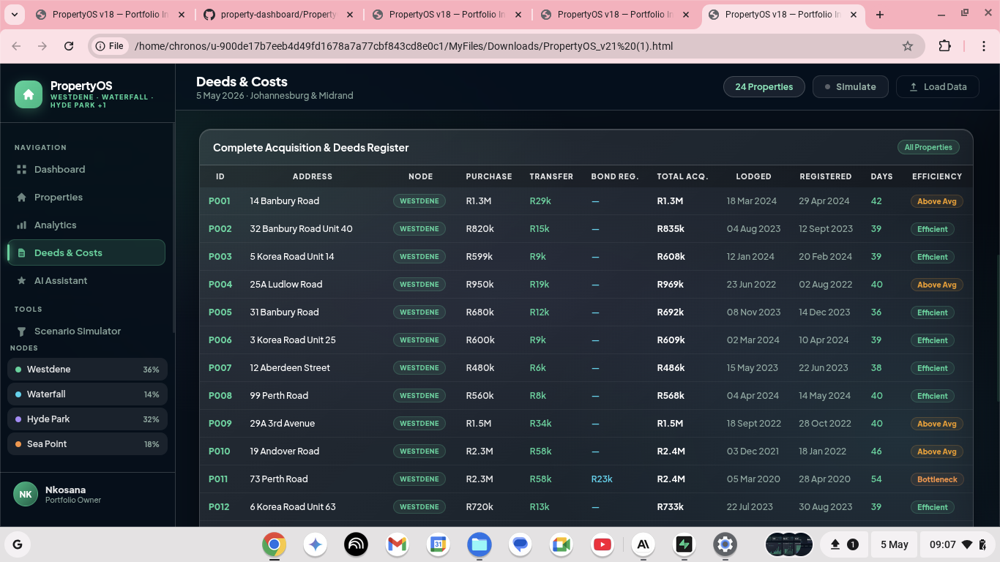
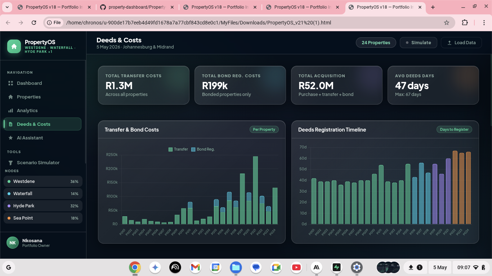
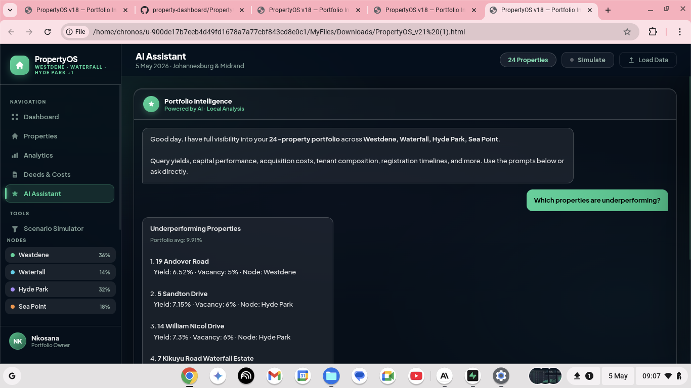

# PropertyOS - A Portfolio Intelligence Dashboard


> A zero-dependency, browser-based property portfolio intelligence platform. Drop in a JSON file and the dashboard renders instantly. No server, no build tools, no cost.

---

## About the Developer

**Nkosana Mlotshwa** is a Graduate Consultant and Business Analyst based in Johannesburg, South Africa, working across legal, financial services, data analytics and technology.

He holds an LLB Honours degree from the University of Pretoria, alongside professional certifications in Microsoft Power BI, Risk Management from the New York Institute of Finance, and Google Data Analytics. He is currently completing a BSc in Computer Science through the University of London, with CIMA planned.

His work sits at the intersection of legal and regulatory thinking, risk and data analytics, and systems design — with a focus on financial services, banking, property investment and technology. He approaches business problems the way an engineer approaches a structure: starting with the foundation, mapping the mechanics, and building solutions that scale.

PropertyOS reflects that approach, it is a practical, data-driven tool built not to impress, but to work.

🔗 [LinkedIn](https://www.linkedin.com/in/nkosana-mlotshwa763b1a2a1) · 📧 nkosanamlotshwa2@gmail.com · 🌐 [Live Dashboard](https://nkosanamlotshwa2-gif.github.io/property-dashboard/PropertyOS_v21.html)

---

## About This Project

PropertyOS started as a professional frustration.

While preparing a property investment analysis across multiple nodes in Gauteng and the Western Cape, the same wall appeared, the existing tools were either too expensive, cloud-dependent, or built for markets that bear no resemblance to the South African property landscape. Spreadsheets were fragile. Power BI required a licence and a data pipeline. Nothing produced a clean, fast, shareable portfolio view without friction.

At some point the decision was made to stop looking and start building.

PropertyOS is a single HTML file. You open it in any browser, load a JSON dataset, and the full platform renders, six chart panels, a live KPI strip, an expandable property inventory, a deeds and acquisition register, an AI portfolio assistant, and a scenario simulator. Nothing is sent anywhere. Everything runs locally.

---

## Live Demo

👉 [Open the Dashboard](https://nkosanamlotshwa2-gif.github.io/property-dashboard/PropertyOS_v21.html)

Download the sample dataset and load it when prompted to explore the full platform with real portfolio data.

📥 [Download Sample Dataset — Nkosana_Properties_v2.json](Nkosana_Properties_v2.json)

---

## Screenshots

### Dashboard — Portfolio Overview


### Dashboard — Simulation Mode Active


### Properties — Expandable Inventory


### Analytics Panel


### Deeds & Costs — Acquisition Register


### Deeds & Costs — Cost Charts


### AI Assistant — Portfolio Intelligence


---

## Portfolio at a Glance

The sample dataset represents a 24-property portfolio across 4 investment nodes and 2 regions.

| Metric | Value |
|---|---|
| Total Portfolio Value | R56.5M |
| Total Purchase Cost | R50.5M |
| Capital Gain | R5.99M (+11.9%) |
| Gross Annual Yield | 8.64% |
| Monthly Rental Income | R406,700 |
| Annual Rental Revenue | R4.88M |
| Investment Nodes | Westdene · Waterfall · Hyde Park · Sea Point |
| Regions | Gauteng · Western Cape |
| Properties | 24 across 4 nodes |
| Avg Deeds Registration | 47 days |

---

## Features

### Dashboard
- **Hero KPI Strip** : Portfolio value, blended yield, monthly income and average vacancy at a glance, with capital gain trend indicators
- **Strategy Quadrant** : Bubble chart plotting every property by gross yield vs capital gain, sized by portfolio weight and colour-coded by investment node. Click any bubble or node label to isolate it across all panels
- **Action Required** : Automatically surfaced alerts for underperforming yield, above-average vacancy, elevated acquisition cost overhead and registration bottlenecks, with a scrollable alert feed
- **Income Trend** : 12-month rolling income projection with node filtering
- **Portfolio Composition** : Donut chart breaking down the portfolio by property type with an interactive legend
- **Node Performance Grid** : Gross yield, monthly income and vacancy rate per node, clickable for full-dashboard focus
- **Scenario Simulator** : Inline sidebar stress-testing with real-time delta readouts

### Properties
- **Expandable Inventory** : Full property list with inline financial detail drawers, node filtering, search by address or type, and multi-field sort
- **Property Modal** : One-click deep-dive showing all financial, acquisition and tenancy data for any property

### Analytics
- **Value vs Purchase Price** : Per-property capital appreciation bar chart
- **Gross Yield Ranking** : Horizontal ranking of all properties by annualised yield
- **Tenant Profile Mix** : Breakdown of professional, student and corporate tenants with vacancy context
- **Acquisition Cost Breakdown** : Transfer and bond registration costs per property

### Deeds & Costs
- **Complete Acquisition Register** : Full table with purchase price, transfer cost, bond registration cost, total acquisition cost, deeds lodgement date, registration date, days to register and efficiency rating per property
- **Transfer & Bond Cost Chart** : Stacked bar chart per property
- **Deeds Registration Timeline** : Days-to-register per property benchmarked against portfolio average

### AI Assistant
- **Portfolio Intelligence Chat** : Natural language querying of the full portfolio dataset. Ask about yields, underperforming properties, acquisition costs, deeds timelines, vacancy analysis, node comparisons, income, capital gains and more
- **Quick-Ask Prompts** : Pre-built common queries for instant insight without typing

### Scenario Simulator
- **SARB Repo Rate stress test** : Model the cash flow impact of rate changes on bonded properties
- **Vacancy stress** : Apply additional vacancy across the portfolio and see net income impact
- **Rental growth** : Project escalation across all income streams
- **Maintenance reserve** : Set aside a percentage of gross income and model net returns
- **Capital value shift** : Simulate market value movements up or down
- **Real-time impact deltas** : Simulated vs baseline for income, net income, portfolio value and gross yield, with per-property impact ranking

---

## JSON Data Format

The dashboard accepts any JSON file structured as an array of property objects. All fields are optional beyond Address and Purchase Price — the platform degrades gracefully for missing data.

```json
[
  {
    "Property ID": "P001",
    "Address": "14 Banbury Road",
    "Suburb": "Westdene",
    "Area": "Johannesburg",
    "Node": "Westdene",
    "Region": "Gauteng",
    "Property Type": "Freehold House",
    "Bedrooms": 3,
    "Bathrooms": 2,
    "Stand Size (m2)": 744,
    "Purchase Price (R)": 1299000,
    "Purchase Date": "2024-03-15",
    "Current Value (R)": 1365000,
    "Monthly Rental (R)": 9500,
    "Vacancy Rate (%)": 5,
    "Tenant Type": "Professional",
    "Transfer Cost (R)": 28600,
    "Bond Registration Cost (R)": 0,
    "Deeds Lodgement Date": "2024-03-18",
    "Deeds Registration Date": "2024-04-29",
    "Deeds Registration Days": 42
  }
]
```

### Supported Property Types

| Type | Dashboard Colour |
|---|---|
| Freehold House | Emerald green |
| Sectional Title Apartment | Cyan |
| Student Commune | Purple |
| Freehold Cottage | Orange |

### Supported Tenant Types

| Type | Indicator Colour |
|---|---|
| Professional | Blue |
| Student | Amber |
| Corporate | Purple |

---

## Project Structure

```
property-dashboard/
│
├── PropertyOS_v21.html           # Full platform — single file, runs in any browser
├── Nkosana_Properties_v2.json   # 24-property sample dataset
├── screenshots/
│   ├── 01_dashboard_overview.png         # Dashboard — portfolio overview
│   ├── 02_dashboard_simulation_mode.png  # Dashboard — simulation mode active
│   ├── 03_properties_inventory.png       # Properties — expandable inventory
│   ├── 04_analytics_panel.png            # Analytics panel
│   ├── 05_deeds_costs_register.png       # Deeds & Costs — acquisition register
│   ├── 06_deeds_costs_charts.png         # Deeds & Costs — cost charts
│   └── 07_ai_assistant.png              # AI Assistant — portfolio intelligence
└── README.md
```

---

## Built With

- [Chart.js 4.4](https://www.chartjs.org/) — All charts and data visualisation
- [Plus Jakarta Sans](https://fonts.google.com/specimen/Plus+Jakarta+Sans) — Primary typeface (Google Fonts)
- Vanilla HTML, CSS and JavaScript — no frameworks, no build tools, no package manager
- [GitHub Pages](https://pages.github.com/) — Free static hosting

---

## Roadmap
The next development cycle of Property-OS will include:

- [ ] PDF export : one-click investor-grade report generation from any panel
- [ ] Cash flow tracker : monthly income, maintenance expenses and net yield per property
- [ ] Bond and mortgage tracker : outstanding balances, equity build and loan-to-value ratios by property
- [ ] Capital growth projections : 5 and 10-year forward modelling with SARB rate scenarios
- [ ] Multi-currency support : USD and GBP conversion for offshore-focused portfolios
- [ ] Shareable snapshot links : generate a read-only URL from any portfolio state
- [ ] Excel and CSV import : accept broader data formats beyond JSON

---

## License

This project is open source and available under the [MIT License](LICENSE).

---

*Built in Johannesburg, South Africa*
